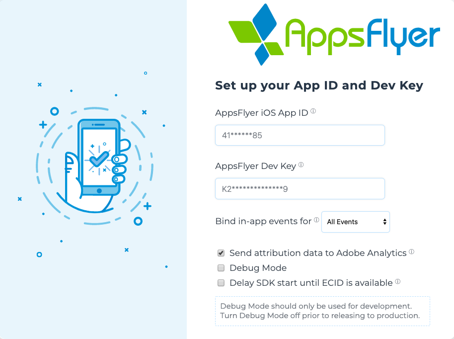
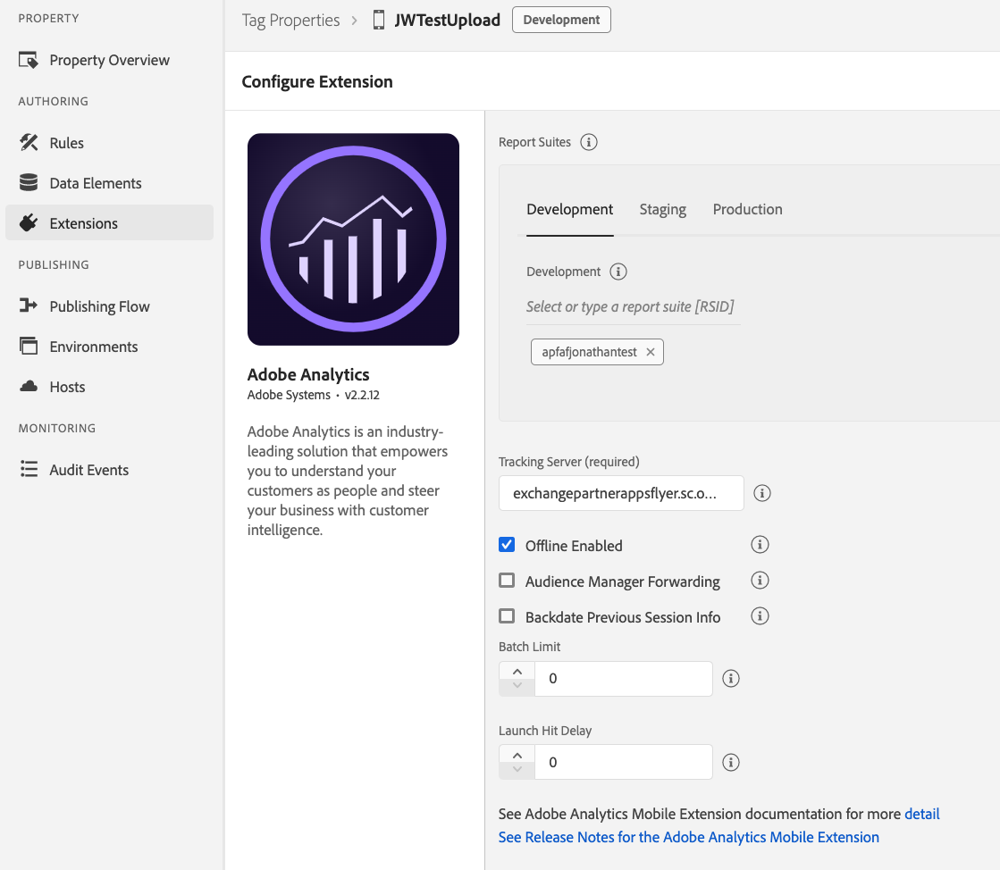
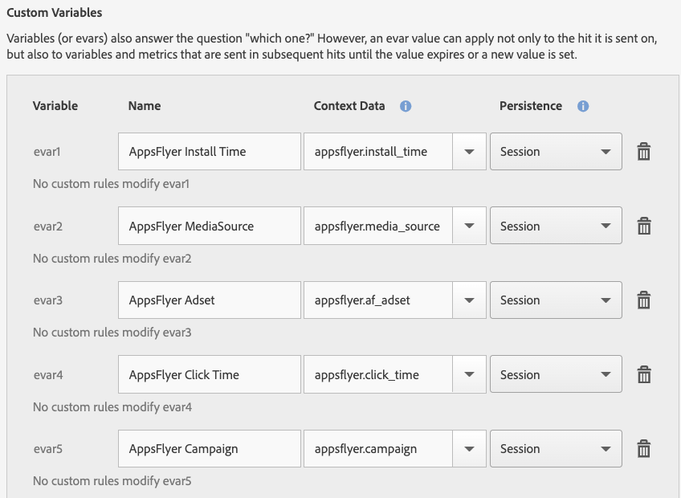
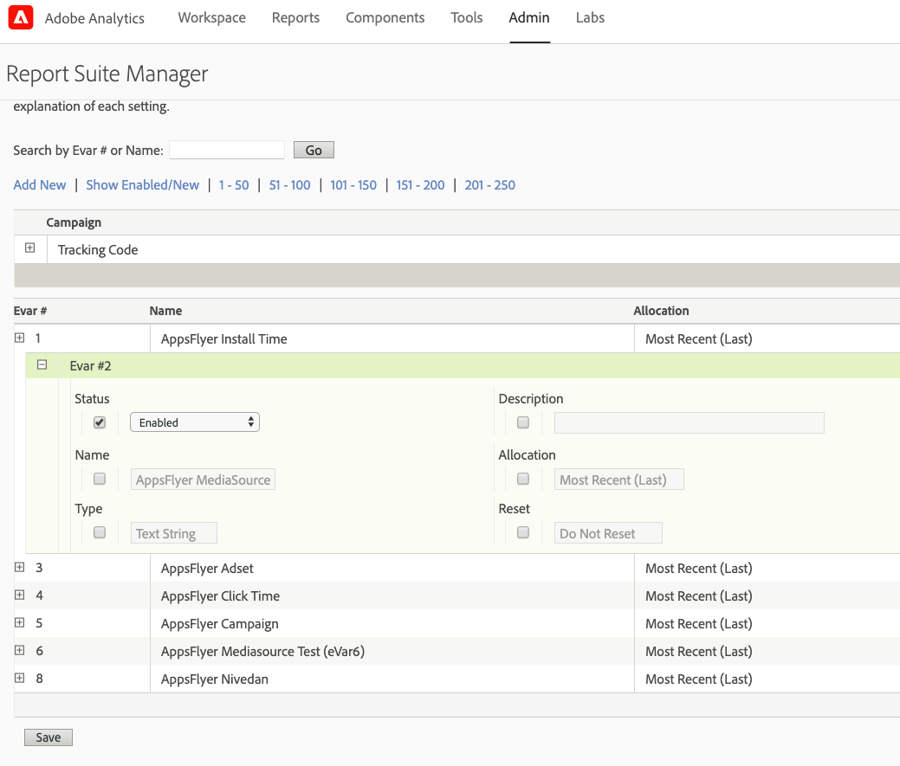
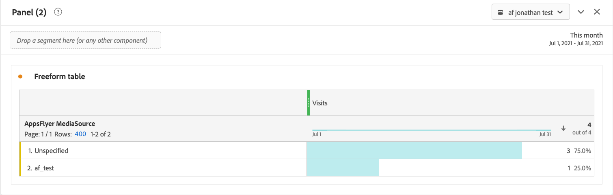
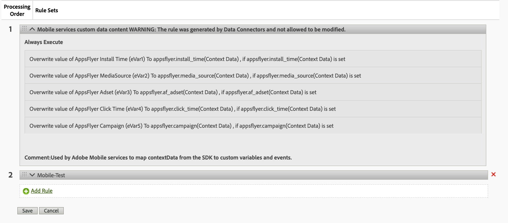

## Connecting AppsFlyer Conversion Data

> Conversion data is sent with events to the Adobe platform. These variables allow you to apply logic and rules to reporting dimensions, metrics, or filters.

1. Enable `AppsFlyer`, `Adobe Analytics` and `Adobe Analytics - Mobile Services` in Launch

2. Map the variables in Adobe Mobile Services

    1. Log in to your Adobe [Mobile Services](https://mobilemarketing.adobe.com/).
    2. Select the relevant app and enter the Manage Variables & Metrics page.
    3. Select the Custom Variables tab and configure the variables to map AppsFlyer SDK data to the Adobe system.
    4. For each custom variable, enter a meaningful name.
    5. Select or type the mapped AppsFlyer conversion data and choose your preferred Persistence scope.

3. Verify the the eVars are enabled 

    1. Log into Adobe Analytics 
    2. Navigate to Admin > Report suites
    3. Select the report suit
    4. Navigate to Edit Settings > Conversion > Conversion Variables
    5. Enable all the relevant eVars

4. Run a [install test](./AdobeAnalytics.md#install-test).

5. Check Adobe Analytics for conversion data.

### Troubleshooting

1. Verify the processing rules are set correctly

    1. Log into Adobe Analytics 
    2. Navigate to Admin > Report suites
    3. Select the report suit
    4. Navigate to Edit Settings > General > Processing Rules

2. Verify the `AppsFlyer Attribution Data` event is sent from the SDK
    1. In the SDK set the logging value to verbose `MobileCore.setLogLevel(LoggingMode.VERBOSE)`
    2. Run a [install test](./AdobeAnalytics.md#install-test)
    3. Check the logs for the `AppsFlyer Attribution Data` action [event](./AdobeAnalytics.md#attr-data).

