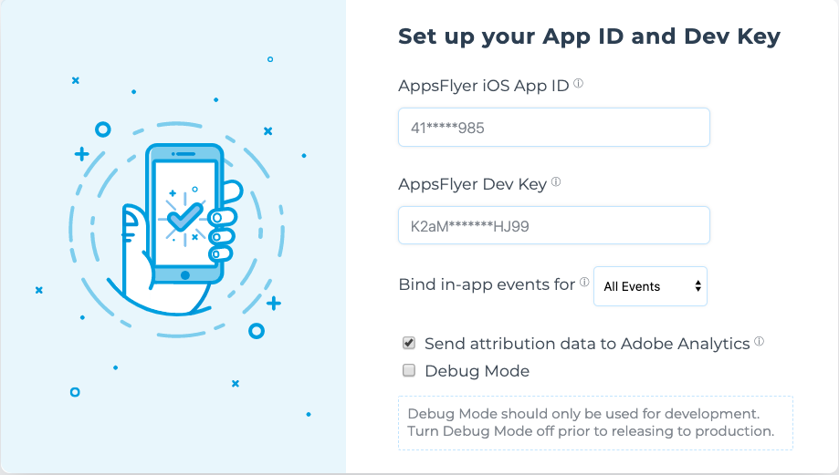

# Guides


## Table of content

- [Deep Linking](#deeplinking)
    - [Deeplink Callbacks](#deeplink-callbacks)
    - [Android Deepling](#android-deeplink)
        - [URI Scheme](#uri-scheme)
        - [App Links](#app-links)
    - [iOS Deeplink Setup](#ios-deeplink)
- [In-App Events](#events)
- [Data Elements](#data-elements)
- [Attribution Data tracking with Adobe Analytics](#attr-data)
- [Deeplink Data tracking with Adobe Analytics](#deeplink-data)
- [Wait for ECID](#wait-for-ecid)
- [Install Test](#install-test)

##  <a id="deeplinking"> Deep Linking
    


#### The 2 Deep Linking Types:
Since users may or may not have the mobile app installed, there are 2 types of deep linking:

1. Deferred Deep Linking - Serving personalized content to new or former users, directly after the installation. 
2. Direct Deep Linking - Directly serving personalized content to existing users, which already have the mobile app installed.

For more info please check out the [OneLink™ Deep Linking Guide](https://support.appsflyer.com/hc/en-us/articles/208874366-OneLink-Deep-Linking-Guide#Intro).

Also, Check out the deferred deeplinkg guide from the AppFlyer knowledge base [here](https://support.appsflyer.com/hc/en-us/articles/207032096-Accessing-AppsFlyer-Attribution-Conversion-Data-from-the-SDK-Deferred-Deeplinking-#Introduction).

Code Sample to handle deeplinking data:

```java
    AppsFlyerAdobeExtension.registerAppsFlyerExtensionCallbacks(new AppsFlyerExtensionCallbacksListener() {
        @Override
        public void onCallbackReceived(Map<String, String> callback) {
            if(callback.get("callback_type").equals("onConversionDataReceived")){
                if(callback.get("is_first_launch").equals("true")){
                    // handle deferred deeplink
                }
            } else if(callback.get("callback_type").equals("onAppOpenAttribution")){
                // handle direct deeplink
            }
            Log.d("TAG", callback.toString());
        }

        @Override
        public void onCallbackError(String errorMessage) {
            Log.d("TAG", errorMessage);
        }
    });
```


###  <a id="android-deeplink"> Android Deeplink Setup
    
    
    
#### <a id="uri-scheme"> URI Scheme
In your app’s manifest add the following intent-filter to your relevant activity:
```xml 
<intent-filter>
    <action android:name="android.intent.action.VIEW" />
    <category android:name="android.intent.category.DEFAULT" />
    <category android:name="android.intent.category.BROWSABLE" />
    <data android:scheme="your unique scheme" />
</intent-filter>
```

#### <a id="app-links"> App Links
For more on App Links check out the guide [here](https://support.appsflyer.com/hc/en-us/articles/115005314223-Deep-Linking-Users-with-Android-App-Links#what-are-android-app-links).


###  <a id="ios-deeplink"> iOS Deeplink Setup
For more on Universal Links check out the guide [here](https://support.appsflyer.com/hc/en-us/articles/208874366-OneLink-Deep-Linking-Guide#setups-universal-links).
    
Essentially, the Universal Links method links between an iOS mobile app and an associate website/domain, such as AppsFlyer’s OneLink domain (xxx.onelink.me). To do so, it is required to:

1. Configure OneLink sub-domain and link to mobile app (by hosting the ‘apple-app-site-association’ file - AppsFlyer takes care of this part in the onelink setup on your dashboard)
2. Configure the mobile app to register approved domains:

```xml
<?xml version="1.0" encoding="UTF-8"?>
<!DOCTYPE plist PUBLIC "-//Apple//DTD PLIST 1.0//EN" "http://www.apple.com/DTDs/PropertyList-1.0.dtd">
<plist version="1.0">
    <dict>
        <key>com.apple.developer.associated-domains</key>
        <array>
            <string>applinks:test.onelink.me</string>
        </array>
    </dict>
</plist>
```


---

##  <a id="events"> In-App Events
    
In the Adobe Launch AppsFlyer Extension you can choose the in-app event setting for your app:



    
    
| Setting        | Description   |
| -------------- | ------------- |
| Action Events  | Only MobileCore.trackAction() will be sent to AppsFlyer                              | 
| State Events   | Only MobileCore.trackState() will be sent to AppsFlyer                               |
| All Events     | Both MobileCore.trackAction() and MobileCore.trackState() will be sent to AppsFlyer  |
| None           | No events will be sent |
    
    
For example, If you have `All Events` selected , then calling this API:

```java
final Map<String,String> eventMap = new HashMap<>();  
eventMap.put("currency", "USD");  
eventMap.put("revenue", "200");  
eventMap.put("freehand", "param");

MobileCore.trackAction("testAnalyticsAction", eventMap);
```

will result in a testAnalyticsAction event tracked on the AppsFlyer Dashboard with a revenue of 200USD.

> revenue and currency parameters are mapped to af_revenue and af_currency.
    
##  <a id="data-elements"> Data Elements
    
Checkout the Data Element [guide](./DataElements.md) for more info. <br/>

> In order data elements to work, the 'Send Attribution Data to Adobe Analytics' setting in the AppsFlyer extension page must be enabled.
    
##  <a id="attr-data"> Attribution Data tracking with Adobe Analytics

When the `Send attribution data to Adobe Analytics` setting is enabled, then a Action events is sent from the AppsFlyer extension to adobe analytics. Here is what you need to know about this event:
1. The event name is "AppsFlyer Attribution Data"
2. The event values are a copy of the conversion data
3. The appsflyer_id is added to the event
4. "appsflyer." is appended to all values 
5. The event is sent on first launch only
6. The Event is sent after the AppsFlyerConversionListener.onConversionDataSuccess method is called.

For example here is a sample `organic` "AppsFlyer Attribution Data" event:

```yaml
{
        class: Event,
        name: Analytics Track,
        eventNumber: 13,
        uniqueIdentifier: a8b5a26a-01d2-****-****-feac597ac2eb,
        source: com.adobe.eventsource.requestcontent,
        type: com.adobe.eventtype.generic.track,
        pairId: null,
        responsePairId: d3371461-****-****-9b7d-3bbafb8d3d52,
        timestamp: 1589810779830,
        data: {
            "action" : "AppsFlyer Attribution Data",
            "contextdata" : {
                "appsflyer.appsflyer_id" : "1589810776752-6880051***1087",
                "appsflyer.af_status" : "Organic",
                "appsflyer.sdk_version" : "version: 5.3.0 (build 14)",
                "appsflyer.af_message" : "organic install",
                "appsflyer.install_time" : "2020-05-18 14:06:19.154",
                "appsflyer.media_source" : "organic"
            }
        }
    }
```

Non-organic example:

```yaml
{
        class: Event,
        name: Analytics Track,
        eventNumber: 13,
        uniqueIdentifier: ef1c9625-8eb0-****-****-202c10203ca8,
        source: com.adobe.eventsource.requestcontent,
        type: com.adobe.eventtype.generic.track,
        pairId: null,
        responsePairId: a49fab46-2dd0-****-****-b4a9ba82dd3d,
        timestamp: 1589814096088,
        data: {
            "action" : "AppsFlyer Attribution Data",
            "contextdata" : {
                "appsflyer.adgroup" : null,
                "appsflyer.af_click_lookback" : "7d",
                "appsflyer.sdk_version" : "version: 5.3.0 (build 14)",
                "appsflyer.esp_name" : null,
                "appsflyer.is_universal_link" : null,
                "appsflyer.appsflyer_id" : "1589814094317-3288*****557929",
                "appsflyer.af_cpi" : null,
                "appsflyer.campaign_id" : null,
                "appsflyer.orig_cost" : "0.0",
                "appsflyer.iscache" : "true",
                "appsflyer.adgroup_id" : null,
                "appsflyer.match_type" : "id_matching",
                "appsflyer.agency" : null,
                "appsflyer.af_status" : "Non-organic",
                "appsflyer.campaign" : "None",
                "appsflyer.install_time" : "2020-05-18 15:01:36.502",
                "appsflyer.media_source" : "af_test",
                "appsflyer.af_siteid" : null,
                "appsflyer.cost_cents_USD" : "0",
                "appsflyer.adset_id" : null,
                "appsflyer.redirect_response_data" : null,
                "appsflyer.is_branded_link" : null,
                "appsflyer.retargeting_conversion_type" : "none",
                "appsflyer.http_referrer" : "https://test.com/test/",
                "appsflyer.engmnt_source" : null,
                "appsflyer.af_sub1" : null,
                "appsflyer.click_time" : "2020-05-18 15:01:29.170",
                "appsflyer.af_sub3" : null,
                "appsflyer.af_sub2" : null,
                "appsflyer.adset" : null,
                "appsflyer.af_sub5" : null,
                "appsflyer.af_sub4" : null
            }
        }
    }
```
    
##  <a id="deeplink-data"> Deeplink Data tracking with Adobe Analytics


When a deeplink is opened, and the `Send attribution data to Adobe Analytics` setting is enabled, then a Action events is sent from the AppsFlyer extension to adobe analytics. Here is what you need to know about this event:
1. The event name is "AppsFlyer Engagement Data"
2. The event values are a copy of the attribution deeplink data
3. The appsflyer_id is added to the event
4. "appsflyer.af_engagement_" is appended to all values 
6. The Event is sent after the AppsFlyerConversionListener.onAppOpenAttribution method is called.

For example here is a sample "AppsFlyer Engagement Data" event:

```yaml
{
        class: Event,
        name: Analytics Track,
        eventNumber: 17,
        uniqueIdentifier: 5b51d80b-9bc7-****-****-d579a77ca356,
        source: com.adobe.eventsource.requestcontent,
        type: com.adobe.eventtype.generic.track,
        pairId: null,
        responsePairId: b7c39fd0-0f02-****-****-f8718b12dc88,
        timestamp: 1589811327647,
        data: {
            "action" : "AppsFlyer Engagement Data",
            "contextdata" : {
                "appsflyer.af_engagement_scheme" : "appsflyer",
                "appsflyer.af_engagement_link" : "appsflyer://test",
                "appsflyer.af_engagement_install_time" : "2020-05-18 14:06:14",
                "appsflyer.af_engagement_host" : "test",
                "appsflyer.af_engagement_path" : ""
            }
        }
    }
```

##  <a id="wait-for-ecid"> Wait for ECID

By default the AppsFlyer SDK sets the ExperienceCloudId (ECID) as the CustomerUserID. <br/>
Setting the `Wait for ECID` setting to true, will guarantee that the ECID will be set on the `first launch`. <br/>
Use this setting if you must have ECID attached to the install.<br/>

If this setting is set to false, ECID will be set as soon as it is available.

##  <a id="install-test"> Install Test

1. Uninstall the app from the device.
2. Find your deviceID. 
3. [Register](https://support.appsflyer.com/hc/en-us/articles/207031996-Registering-test-devices-) your device as a test device
4. Generate a tracking link: (3 options)
    1. Create a link via the AppsFlyer dashboard
    2. Use the [SDK integration test](https://support.appsflyer.com/hc/en-us/articles/360001559405-Test-mobile-SDK-integration-with-the-app#test-from-dashboard)
    3. Create a [custom link](https://support.appsflyer.com/hc/en-us/articles/207447163-Attribution-link-structure-and-parameters) 


    ```
    https://app.appsflyer.com/<your-app-id>?pid=af_test&advertising_id=<your_gaid>

    Example:
    https://app.appsflyer.com/com.test?pid=af_test&advertising_id=1f******-****-****-********745e

    ```
5. Click the link on the device 
6. Install & Launch the app
7. Check the AppsFlyer Dashboard for the install